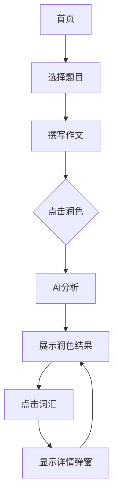

## 1. Product Overview
四六级英语写作助手是一款帮助学生提升英语写作能力的在线工具。应用提供真题作文题目，用户可撰写作文并获得AI智能润色建议，包括高级词汇替换、句式优化等，以可视化方式展示修改建议并提供双语解释。

## 2. Core Features

### 2.1 User Roles
| Role | Registration Method | Core Permissions |
|------|---------------------|------------------|
| User | None (anonymous) | Access all writing and polishing features |

### 2.2 Feature Module
1. **首页**: 真题题目列表、作文写作区域
2. **润色结果页**: 可视化展示修改建议、词汇详情弹窗

### 2.3 Page Details
| Page Name | Module Name | Feature description |
|-----------|-------------|---------------------|
| 首页 | 题目选择 | 展示四六级真题作文题目列表，支持筛选年份和级别 |
| 首页 | 写作区域 | 文本编辑器，用户输入作文内容 |
| 首页 | 润色按钮 | 触发AI润色功能 |
| 润色结果 | 原文展示 | 红色划线标记需修改的词汇和句子 |
| 润色结果 | 建议展示 | 绿色字体显示替换建议 |
| 词汇详情 | 弹窗展示 | 双语解释、示例句子 |

## 3. Core Process
用户进入首页 → 选择作文题目 → 在编辑器中撰写作文 → 点击润色按钮 → AI分析并返回修改建议 → 用户查看可视化润色结果 → 点击词汇查看详情

## 4. User Interface Design

### 4.1 Design Style
- Primary color: #3B82F6 (blue) - representing trust and learning
- Secondary color: #10B981 (green) - representing improvement and positive feedback
- Accent color: #EF4444 (red) - highlighting areas needing improvement
- Button style: rounded corners, shadow effects
- Font: Inter, sans-serif
- Layout: clean card-based design with clear sections

### 4.2 Page Design Overview
| Page Name | Module Name | UI Elements |
|-----------|-------------|-------------|
| 首页 | Header | Logo, title, brief description |
| 首页 | Question List | Cards showing year, level, topic |
| 首页 | Editor | Large textarea with placeholder |
| 首页 | Action Bar | Polish button with loading state |
| 润色结果 | Comparison View | Split view showing original vs improved |
| 词汇详情 | Modal | Word, phonetic, Chinese meaning, examples |

### 4.3 Responsiveness
- Desktop-first design
- Mobile adaptive with stacked layout
- Touch-friendly button sizes

### 4.4 3D Scene Guidance
Not applicable for this project
