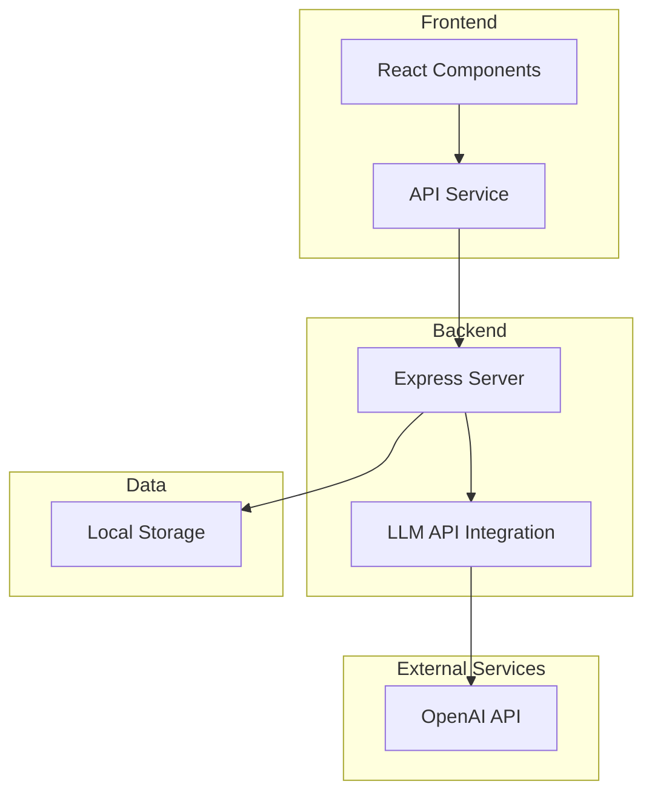
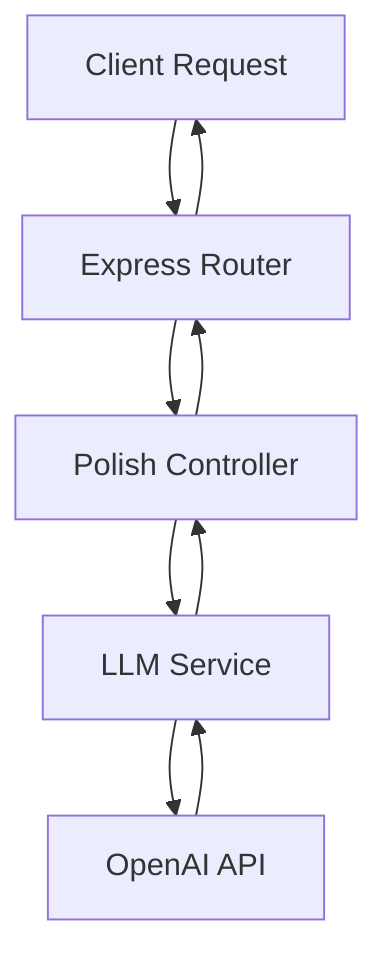
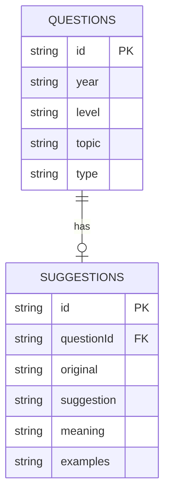

## 1. Architecture Design


## 2. Technology Description
- Frontend: React@18 + TypeScript + TailwindCSS@3 + Vite
- Initialization Tool: vite-init with react-ts template
- Backend: Express@4 + TypeScript
- API: OpenAI GPT-4 API for text analysis and polishing
- State Management: React useState/useReducer
- Styling: TailwindCSS 3

## 3. Route Definitions
| Route | Purpose |
|-------|---------|
| / | Home page with question selection and editor |
| /polish | Polishing results page |

## 4. API Definitions

### 4.1 Backend Routes
| Endpoint | Method | Purpose | Request Body | Response |
|----------|--------|---------|--------------|----------|
| /api/polish | POST | Process essay and return polish suggestions | { essay: string, question: string } | { suggestions: Array } |
| /api/questions | GET | Get list of essay questions | - | { questions: Array } |

### 4.2 Data Types
```typescript
interface Question {
  id: string;
  year: string;
  level: 'CET4' | 'CET6';
  topic: string;
  type: 'argumentation' | 'application' | 'description';
}

interface WordSuggestion {
  original: string;
  suggestion: string;
  meaning: string;
  examples: string[];
  position: { start: number; end: number };
}

interface SentenceSuggestion {
  original: string;
  suggestion: string;
  explanation: string;
  examples: string[];
}

interface PolishResult {
  wordSuggestions: WordSuggestion[];
  sentenceSuggestions: SentenceSuggestion[];
  overallFeedback: string;
}
```

## 5. Server Architecture Diagram


## 6. Data Model

### 6.1 Data Model Definition


### 6.2 Data Definition Language
```sql
CREATE TABLE questions (
    id TEXT PRIMARY KEY,
    year TEXT NOT NULL,
    level TEXT NOT NULL CHECK(level IN ('CET4', 'CET6')),
    topic TEXT NOT NULL,
    type TEXT NOT NULL CHECK(type IN ('argumentation', 'application', 'description'))
);

CREATE TABLE suggestions (
    id TEXT PRIMARY KEY,
    question_id TEXT REFERENCES questions(id),
    original TEXT NOT NULL,
    suggestion TEXT NOT NULL,
    meaning TEXT,
    examples TEXT
);
```

### 6.3 Initial Mock Data
```typescript
const mockQuestions = [
  { id: '1', year: '2024', level: 'CET4', topic: 'The Importance of Reading', type: 'argumentation' },
  { id: '2', year: '2024', level: 'CET6', topic: 'Artificial Intelligence and Modern Life', type: 'argumentation' },
  { id: '3', year: '2023', level: 'CET4', topic: 'My Favorite Hobby', type: 'description' },
  { id: '4', year: '2023', level: 'CET6', topic: 'Environmental Protection in Cities', type: 'argumentation' },
];
```
